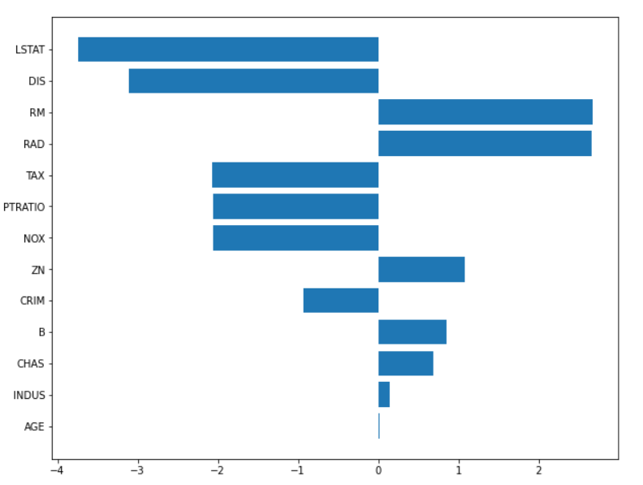
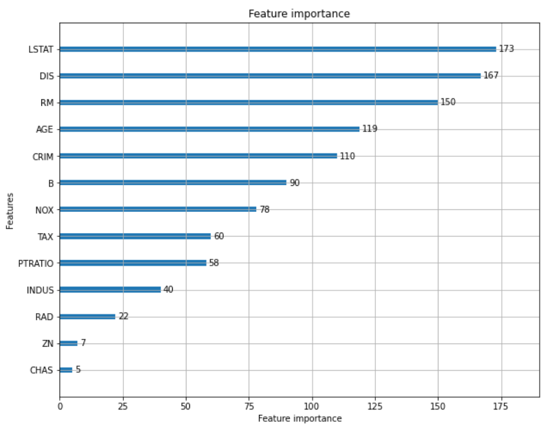
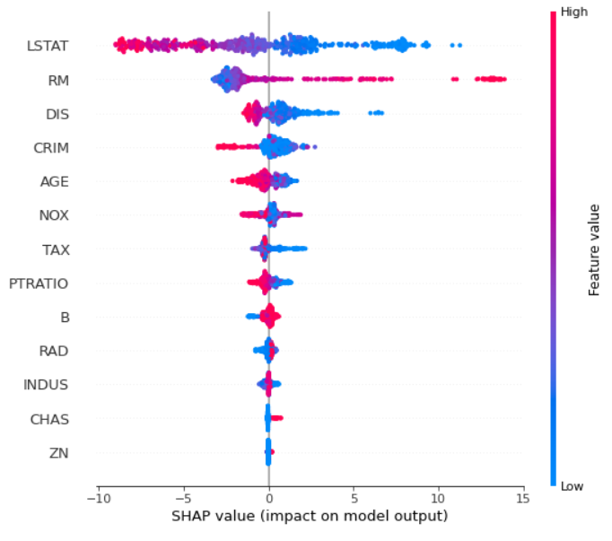
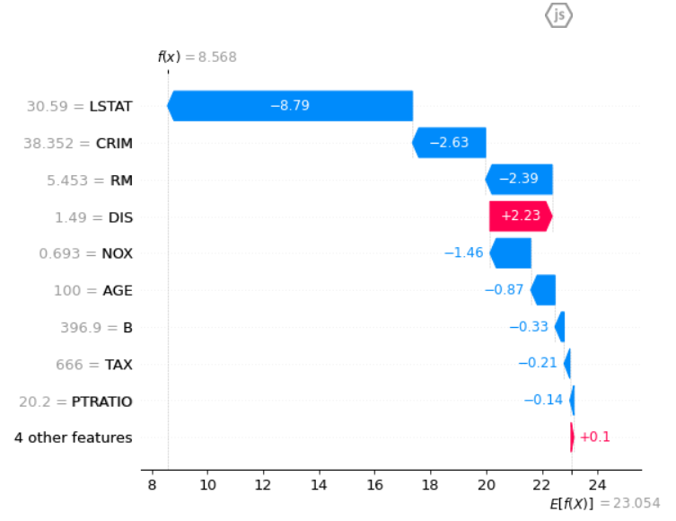
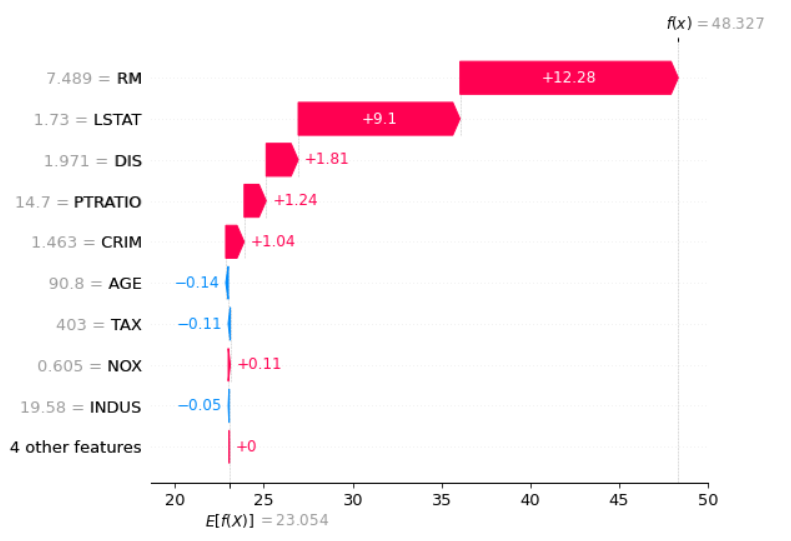
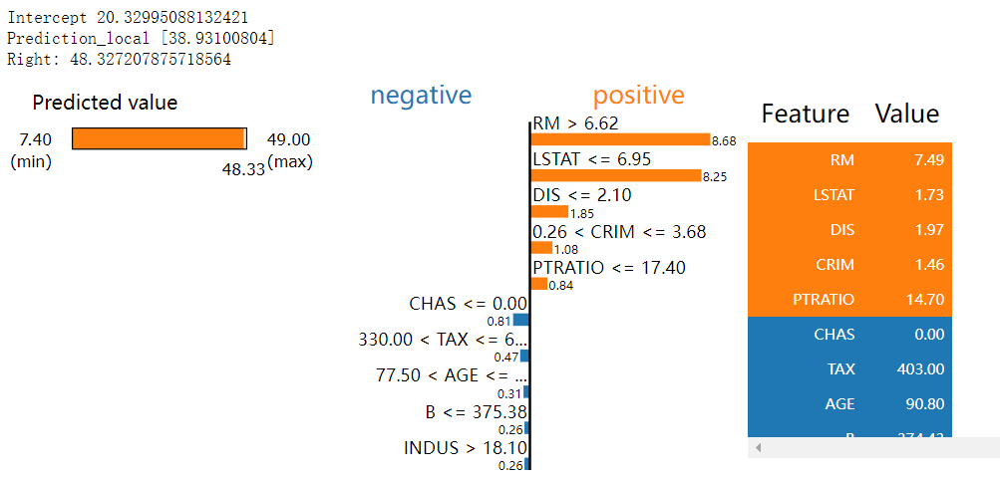
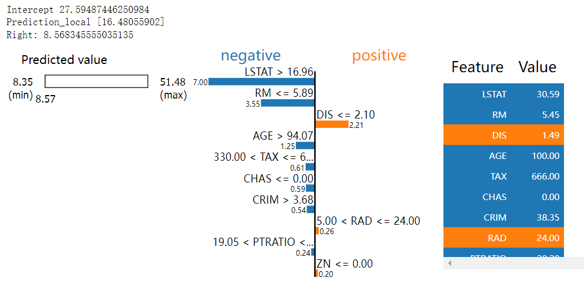

## 1.为什么要模型可解释性

- 模型的决策对场景影响越大，模型对它行为的解释就越重要
- 可解释性便于人类理解模型的决策，模型必须“说服” 我们，这样它们才能达到预期的⽬标
- 我们需要模型可解释性来找出问题的隐患，如员工离职预测，我们需要通过可解释性来找出离职背后的真正原因，以采取相应的措施


## 2.模型可解释性的应用场景

- Tabular：回归（价格/销量/流量预测） + 分类（违约/ctr/异常检测）

- NLP：情感分类

- CV：目标检测 + 识别

  

## 3.模型可解释性理论方法

### 3.1 可解释的模型方法

#### 3.1.1 线性回归

线性回归 (Linear Regression) 模型将⽬标预测为特征输⼊的加权和，⽽所学习关系的线性使解释变得容易。线性模型可⽤于建模回归⽬标 *y* 对某些特征 *x* 的依赖性。由于学到的关系是线性的，可以针对第 *i*个实例写成如下：
$$
y = \sum_{i = 1}^{n} w_ix_i + b
$$
实例的预测结果是其*n* 个特征的加权和。参数 *w*表⽰要学习的特征权重或系数，其中 *b*称为截距，不与特征相乘。


#### 3.1.2 树模型

基于树的模型根据特征中的某些截断值多次分割 (Split，或称分裂、拆分) 数据。通过分割，可以创建数据集的不同⼦集，每个实例都属于⼀个⼦集。最后的⼦集称为终端 (Terminal) 或叶节点 (Leaf Nodes)，中间的⼦集称为内部节点 (Internal Nodes) 或分裂节点 (Split Nodes)。为了预测每个叶节点的结果，使⽤该节点中训练数据的平均结果。树模型可⽤于分类和回归。


在决策树中，⼀个特征的总体重要性可以⽤以下⽅法计算：遍历使⽤该特征的所有分割，并测量它相对于⽗节点减少了多少⽅差或基尼指数。所有重要性的总和被缩放为 100，这意味着每个重要性可以解释为总体模型重要性的⼀部分。


### 3.2 模型无关的方法

#### 3.2.1 LIME（局部解释）

对于一个分类器（复杂模型），想用一个可解释的模型（简单模型如线性规划），搭配可解释的特征进行适配，并且这个可解释模型再局部的表现上很接近复杂模型的效果


如图所示，红色和蓝色区域表示一个复杂的分类模型（黑盒），图中加粗的红色十字表示需要解释的样本，显然，我们很难从全局用一个可解释的模型（例如线性模型）去逼近拟合它。但是，当我们把关注点从全局放到局部时，可以看到在某些局部是可以用线性模型去拟合的。具体来说，我们从加粗的红色十字样本周围采样，所谓采样就是对原始样本的特征做一些扰动，将采样出的样本用分类模型分类并得到结果（红十字和蓝色点），同时根据采样样本与加粗红十字的距离赋予权重（权重以标志的大小表示）。虚线表示通过这些采样样本学到的局部可解释模型，在这个例子中就是一个简单的线性分类器。在此基础上，我们就可以依据这个局部的可解释模型对这个分类结果进行解释了。

LIME函数分为三个模块进行：

1）目标函数：

解释模型定义为模型g∈G，我们进一步使用πx（z）作为实例z与x之间的接近度，以定义x周围的局部性。定义一个目标函数ξ，这里的L函数作为一个度量，描述如何通过πx在局部定义中，不忠诚的g如何逼近f（复杂模型），在当Ω(g)(解释模型复杂度)足够低可以被人类理解时，我们最小化L函数得到目标函数的最优解。LIME产生的解释如下：
$$
\xi(x)=\underset{g \in G}{\operatorname{argmin}} L\left(f, g, \pi_{x}\right)+\Omega(g)
$$
2）引入相似度后的目标函数：

对这个样本进行可解释的扰动（即采样），论文中还对扰动前后的样本相似度的距离进行了定义，这取决于样本的类型（文本的话就是余弦相似性，图像的话就是L2范数距离）。则相似度计算公式如下：
$$
\pi_{x}(z)=\exp \left(-\frac{D(x, z)^{2}}{\sigma^{2}}\right)
$$
3）最终函数

有了相似度的定义，便可以将原先的目标函数改写成如下的形式。其中f(z)就是扰动样本，在d维空间（原始特征）上的预测值，并把该预测值作为答案，g(z’)则是在d’维空间（可解释特征）上的预测值，然后以相似度作为权重，因此上述的目标函数便可以通过线性回归的方式进行优化。
$$
\xi(x)=\sum_{z^{\prime}, z \in Z} \pi_{x}(z)\left(f(z)-g\left(z^{\prime}\right)\right)^{2}
$$
于是整个LIME的步骤如下:

- 对整个数据进行训练，模型可以是Lightgbm，XGBoost等复杂的模型（本身不可解释）
- 选择我们想要解释的样本X
- 对要解释的样本X进行可解释的N次扰动，生成局部样本，并使用复杂模型预测出这些局部样本的结果
- 对这些新的局部样本的结果赋予权重（学习权重），这个权重是这些数据点与我们要解释的数据之间的距离
- 根据上面新的局部样本，拟合一个简单的模型G，比如Lasso Regression得到模型的权重
- 通过简单模型G来对原复杂模型在X点附近进行解释


#### 3.2.2 SHAP（全局解释 + 局部解释）

SHAP 属于模型事后解释的方法，它的核心思想是计算特征对模型输出的边际贡献，再从全局和局部两个层面对“黑盒模型”进行解释。SHAP构建一个加性的解释模型，所有的特征都视为“贡献者”。

对于每个预测样本，模型都产生一个预测值，SHAP value就是该样本中每个特征所分配到的数值

基本思想：计算一个特征加入到模型时的边际贡献，然后考虑到该特征在所有的特征序列的情况下不同的边际贡献，取均值，即某该特征的SHAP baseline value

举个例子，我们可以想象一个机器学习模型(假设是线性回归，但也可以是其他任何机器学习算法)，知道这个人的年龄、性别和工作，它可以预测一个人的收入。

Shapley值是基于这样一种想法，即应该考虑每个特征可能的组合的结果来决定单个特征的重要性。在我们的例子中，这对应于f特征的每个可能组合(f从0到F， F是所有可用特征的数量)。

在数学中，这被称为“power set”，可以用树表示。


特征的Power set
**每个节点代表一个特征组合，每条边代表包含一个在前一个组合中不存在的特征。**

我们从数学上知道一个幂集的容量是2^n，其中n是原始集合的元素个数。实际上，在我们的例子中，我们有2^F = 2^3= 8个可能的特征的组合。

现在，**SHAP需要为幂集中的每个不同的组合训练一个不同的预测模型，这意味着有2^F个模型**。当然，这些模型在涉及到它们的超参数和训练数据时是完全等价的。唯一改变的是模型中包含的一组特征。

假设我们已经在相同的训练数据上训练了8个线性回归模型。我们可以用一个新的观察样本(我们称之为x₀)，看看同样的8种不同的模型对这个观察样本的预测。


用不同模型预测x₀。在每个节点上，第一行表示特征的组合，第二行为x₀的模型预测收入。

这里，每个节点代表一个模型。但是边代表什么呢？
正如上面所看到的，由一条边连接的两个节点只因为一个特征而不同，即底部的节点与上部的节点具有完全相同的特征，而上部的节点则没有。因此，两个连接节点的预测之间的差距可以归结为该附加特征的影响。这被称为特性的**“边际贡献”**。

因此，每条边代表一个特征对模型的边际贡献。假设我们在节点1中，节点1是一个没有任何特征的模型。该模型将简单地预测所有训练观察样本值的平均收入(50k美元)。如果我们到了节点2，这是一个模型只有一个特征(年龄)，现在对x₀的预测为40k美元。这意味着知道x₀的年龄降低了我们的预测10k美元。

因此，年龄对只包含年龄作为特征的模型的边际贡献是-10k$。公式：

$$
M C_{\text {Age },\{\text { Age }\}}\left(x_{0}\right)=\operatorname{Predict}_{\{\text {Age }}\left(x_{0}\right)-\operatorname{Predict}_{\varnothing}\left(x_{0}\right)=40 k \$-50 k \$=-10 k \$
$$
当然，获得年龄对最终模型的整体效果(即x₀的年龄的SHAP值)，有必要考虑年龄在所有出现过模型的边际贡献。在我们的树表示中，这意味着要考虑连接两个节点的所有边：

上一个节点不包含年龄，且

下一个节点中包含年龄

在下面的图中，这些边已经用红色突出显示。


年龄的边际贡献
所有这些边际贡献然后通过加权平均数加以汇总。公式：
$$
\begin{aligned}
\operatorname{SHAP}_{\text {Age }}\left(x_{0}\right)=& w_{1} \times M C_{A g e,\{A g e\}}\left(x_{0}\right)+\\
& w_{2} \times M C_{A g e,\{\text { Age,Gender }\}}\left(x_{0}\right)+\\
& w_{3} \times M C_{A g e,\{\text { Age, Job }\}}\left(x_{0}\right)+\\
& w_{4} \times M C_{A g e,\{\text { Age, Gender,Job }\}}\left(x_{0}\right)
\end{aligned}
$$
其中
$$
w_1+w_2+w_3+w_4=1
$$

我们如何确定边的权重(即4个模型中年龄的边际贡献)？

想法是：

所有边际贡献对具有1个特征的模型的权重之和应等于所有边际贡献对具有2个特征的模型的权重之和，以此类推……，换句话说，同一“行”上所有权值的和应该等于任意其他“行”上所有权值的和。在我们的例子中，这意味着：
$$
w_1= w_2+ w_3= w_4
$$
对每个f，f个特征的模型的所有的边际贡献的权重应该是相等的。换句话说，同一“行”上的所有边应该相等。在我们的例子中，这意味着：
$$
w_2 = w_3
$$
因此，(记住它们的和应该是1)：

$$
w_1 = 1/3\\

w_2 = 1/6\\

w_3 = 1/6\\

w_4 = 1/3\\
$$
通过上图，我们可以得出一般框架中确定权重的模式：

边的权值是同一“行”中边总数的倒数。或者，同样地，f个特征的模型的边际贡献的权重是可能的边际贡献的数量的倒数。即有最终计算*x₀*的Age的SHAP值所需的所有元素：
$$
SHAP_{Age}(x_0) = \frac{1}{3} \times(-10 k \$)+\frac{1}{6} \times(-9 k \$)+\frac{1}{6} \times(-15 k \$)+\frac{1}{3} \times(-12 k \$)=-11.33 k
$$


#### 3.2.3 InterpretDL

InterpretDl是基于飞桨的可解释性算法库。
根据应用领域的不同，可以划分：

- 计算机视觉（CV）
- 自然语言处理（NLP）
- 结构化数据（Table）

根据解释的对象不同，可以划分：

1. 基于输入特征的算法

   - 概念：基于输入特征的算法可以解释每个特征在推理中的重要性。其基本原理是通过直接对模型输入进行改动，从而根据得到的梯度或是模型的输出，判断出输入特征的重要程度。

   - 代表性算法：SmoothGrad：基于最直接的对输入特征算梯度的Gradient算法，SmoothGrad给模型输入随机添加一定程度的噪音，再对其计算梯度，并取几轮计算的平均值，使解释结果更加稳定。

2. 基于模型中间特征的算法

   - 概念：基于模型中间特征的算法着重于对输入经过模型时的中间特征进行一些操作，最终以热力图的形式展示关键区域。

   - 代表性的算法：GradCAM：对模型的中间层特征图计算梯度，和特征图结合，得到对输入特征的重要性解释。

3. 对训练数据解释的算法

   - 概念：对训练数据中的每一个样本记录相关信息，可以得到不同样本在训练模型过程中扮演的角色，从而进一步理解并调整数据集。

   - 代表性的算法：

     - Forgetting Events：通过记录训练过程中样本的预测数据，得到哪些经常在上一轮训练预测正确，但在下一轮预测错误的样本，这些样本被认为是模型难以学习的部分。

     - Influence Function：对于任意图片，可以计算训练数据中各个样本对此图片预测结果的贡献度，找到对其贡献最大的样本。

     - Training Data analYzer：百度自研的训练数据分析算法，通过分析训练过程中模型对样本的预测数据，按样本学习的难易程度划分，找到潜在的错标样本。


## 4.模型可解释性工具比较

|             | 速度 | 处理非线性 | 单一模型限制 |   局部解释   |
| :---------: | :--: | :--------: | :----------: | :----------: |
|  线性模型   |  快  |     弱     |     限制     |  可局部解释  |
|   树模型    |  快  |     强     |     限制     | 无法局部解释 |
|    LIME     |  慢  |     强     |    无限制    |  可局部解释  |
|    SHAP     |  慢  |     强     |    无限制    |  可局部解释  |
| InterpretDL |  慢  |     强     |    无限制    |  可局部解释  |


## 5.模型可解释性与模型工作流的集成

下面以波士顿房价作为各可解释性方法的Coding演示：

### 5.1 基于线性回归的特征权重系数

```python
import numpy as np
import pandas as pd
from sklearn.datasets import load_boston
from sklearn.preprocessing import StandardScaler
from sklearn.linear_model import LinearRegression
import matplotlib.pyplot as plt

# 导入数据
data = pd.DataFrame(load_boston()['data'],columns = load_boston()['feature_names'].tolist())
data['Price'] = load_boston()['target']

# 定义特征和target
cols = [i for i in data.columns if i != 'Price']
label = ['Price']

#数据标准化
lr_data = data
ss = StandardScaler()
lr_data[cols] = ss.fit_transform(lr_data[cols])

#训练模型
lr = LinearRegression()
lr.fit(lr_data[cols],lr_data[label])

#画出特征权重系数值ranking图
plt.figure(figsize = (10,8))
rank_idx = abs(lr.coef_).argsort()
sort_cols = [cols[i] for i in rank_idx[0]]
sort_coef = [lr.coef_.tolist()[0][i] for i in rank_idx[0]]
plt.barh(sort_cols,sort_coef)

```



由上图可知，影响价格降低的头部因素是**低收入人群占比（LSTAT)**和**到市就业中心的距离（DIS）**，而影响价格升高的头部因素是**每栋房屋的平均房间数（RM）**和**到径向公路的可达性系数（RAD）**


### 5.2 基于树模型（LightGBM）的特征重要性

```python
import numpy as np
import pandas as pd
from sklearn.datasets import load_boston
from sklearn.preprocessing import StandardScaler
from sklearn.model_selection import train_test_split
from sklearn.linear_model import LinearRegression
import matplotlib.pyplot as plt
import lightgbm as lgb

# 导入数据
data = pd.DataFrame(load_boston()['data'],columns = load_boston()['feature_names'].tolist())
data['Price'] = load_boston()['target']

# 定义特征和target
cols = [i for i in data.columns if i != 'Price']
label = ['Price']

#划分训练集和验证机，防止过拟合
tree_data = data.copy()
X_train, X_val, y_train, y_val = train_test_split(tree_data[cols], tree_data[label], test_size = 0.2, random_state=2022)

#训练模型
model = lgb.LGBMRegressor()
model.fit(X_train,y_train,early_stopping_rounds=10,eval_set=[(X_val,y_val)],verbose=10)


#画出树模型的特征重要性
lgb.plot_importance(model,figsize = (10,8),importance_type = 'split')
```



由上图可以看出，树模型的特征重要性并没有正负相关影响。从结果上看，与线性回归的前四个特征排名相差无几（RAD换成除了AGE）


### 5.3 基于SHAP的可解释性

#### 5.3.1 全局解释

```python
#初始化
shap.initjs()

#指定训练好的模型（此处使用上面训练好的LGB）
explainer = shap.Explainer(model)

#指定要计算SHAP的数据
shap_values = explainer(data[cols])

#绘制全局数据点的SHAP值分布图
shap.summary_plot(shap_values,data[cols])
```



由上图：

- 颜色表示特征值，红色代表高，蓝色代表低。
- 可以看出当“低收入人群”（LSTAT）越大时，drive房价变低
- 可以看出当“每栋房屋的平均房间数”（RM）越大时，drive房价变高


#### 5.3.2 局部解释

- 取Price最低的样本做分析

```python
#初始化
shap.initjs()

#指定训练好的模型
explainer = shap.Explainer(model)

#指定要计算SHAP的数据
shap_values = explainer(data[cols])

#画出样本中Price最低的SHAP值图
shap.plots.waterfall(shap_values[398])
```



由上图：

- **低收入人群占比（LSTAT)**和**犯罪率（CRIM）**成为drive房价变低的头部因素

由数据查之：

- 该样本的犯罪率高达**38.51**，而所有样本犯罪率均值仅有**3.61**
- 该样本的低收入人群占比高达**30.59**，而所有样本低收入人群占比均值仅有**12.65**

- 取Price最高的样本做分析

```python
#初始化
shap.initjs()

#指定训练好的模型
explainer = shap.Explainer(model)

#指定要计算SHAP的数据
shap_values = explainer(data[cols])

#画出样本中Price最高的SHAP值图
shap.plots.waterfall(shap_values[161])
```



由上图：

- **每栋房屋的平均房间数（RM)**和**低收入人群占比（LSTAT)**成为drive房价变高的头部因素

由数据查之：

- 该样本的平均房间数为**7.489**，而所有样本平均房间数均值为**6.28**
- 该样本的低收入人群占比为**1.73**，而所有样本低收入人群占比均值为**12.65**


### 5.4  基于LIME的可解释性

#### 5.4.1 局部解释

- 取Price最高的样本做分析

```python
# 导入相关LIME包
from lime.lime_tabular import LimeTabularExplainer

# 指定target + columns + 问题类型（Regression or Classification）
explainer = LimeTabularExplainer(data[cols].values, feature_names = cols, 
                                 class_names = label, mode = 'regression',verbose = True)

#指定要分析的案例，此处指定房价最低的样本（index = 161）
exp = explainer.explain_instance(data[cols].iloc[161,:], model.predict)
exp.show_in_notebook(show_table=True)
```



- 取Price最低的样本做分析

  ```python
  # 导入相关LIME包
  from lime.lime_tabular import LimeTabularExplainer
  
  # 指定target + columns + 问题类型（Regression or Classification）
  explainer = LimeTabularExplainer(data[cols].values, feature_names = cols, 
                                   class_names = label, mode = 'regression',verbose = True)
  
  #指定要分析的案例，此处指定房价最低的样本（index = 398）
  exp = explainer.explain_instance(data[cols].iloc[398,:], model.predict)
  exp.show_in_notebook(show_table=True)
  ```

  

由上图：

- LIME与SHAP的分析结果大同小异
- 在结果细节显示上，LIME更胜一筹，更易读懂
- 在代码复杂度上，SHAP更加清晰明了，封装的更好


## 6.Best Practices

### 6.1 Tabular

### 6.2 CV

#### 6.2.1 介绍

##### 6.2.1.1 背景

在CV领域中，深度学习模型一般会有上千万个参数。基于这种特性，深度学习模型一直被当作是一个“黑盒”，难以对其进行解释。这会带来两个问题：

- 模型的准确性高只能反映出数据和推理结果的相关性，无法解释因果关系。因为不知道模型根据样本的哪些位置，什么特征进行的判断；
- 模型的推理错误无法反推出是由于模型中的哪个参数或网络层导致的。

基于此，本文借助飞桨的可解释性算法库--InterpretDL，对CV模型做可解释性分析。

#### 6.2.2 实践

下面以猪器官病变检测模型为例，并以预训练的模型作为对比，来分析模型的可解释性。

##### 6.2.2.1 操作平台

本地ubuntu机器

##### 6.2.2.2 环境安装

```shell
# 1.安装对应版本的paddlepaddle-gpu或者cpu版本的paddlepaddle
python -m pip install paddlepaddle-gpu==2.3.0.post101 -f https://www.paddlepaddle.org.cn/whl/linux/mkl/avx/stable.html

python -m pip install paddlepaddle==2.3.0 -i https://mirror.baidu.com/pypi/simple

# 2.安装interpretdl
pip install interpretdl -i https://pypi.tuna.tsinghua.edu.cn/simple
# 3.代码配置
git clone https://github.com/PaddlePaddle/InterpretDL.git
cd InterpretDL && pip install -e .
# 4.单元测试
# run gradcam unit tests
python -m unittest -v tests.interpreter.test_gradcam
# run all unit tests
python -m unittest -v
```

验证paddlepadlde是否安装正确：
安装完成后可以使用`python`进入python解释器，输入`import paddle`，再输入`paddle.utils.run_check()` 如果出现PaddlePaddle is installed successfully!，说明您已成功安装。

##### 6.2.2.3 使用指导

所有解释器都继承类 Interpreter, 借助 interpret(**kwargs) 以调用。

```python
# an example of SmoothGradient Interpreter.
import interpretdl as it
from paddle.vision.models import resnet50
paddle_model = resnet50(pretrained=True)
sg = it.SmoothGradInterpreter(paddle_model, use_cuda=True)
gradients = sg.interpret("test.jpg", visual=True, save_path=None)
```

##### 6.2.2.4 猪器官病变检测任务的InterpretDL实践

###### 6.2.2.4.1 构建ResNet50_vd网络

```python
from __future__ import absolute_import, division, print_function

import numpy as np
import paddle
from paddle import ParamAttr
import paddle.nn as nn
from paddle.nn import Conv2D, BatchNorm, Linear
from paddle.nn import AdaptiveAvgPool2D, MaxPool2D, AvgPool2D
from paddle.nn.initializer import Uniform
import math

from ppcls.arch.backbone.base.theseus_layer import TheseusLayer
from ppcls.utils.save_load import load_dygraph_pretrain, load_dygraph_pretrain_from_url

MODEL_URLS = {
    "ResNet18":
    "https://paddle-imagenet-models-name.bj.bcebos.com/dygraph/legendary_models/ResNet18_pretrained.pdparams",
    "ResNet18_vd":
    "https://paddle-imagenet-models-name.bj.bcebos.com/dygraph/legendary_models/ResNet18_vd_pretrained.pdparams",
    "ResNet34":
    "https://paddle-imagenet-models-name.bj.bcebos.com/dygraph/legendary_models/ResNet34_pretrained.pdparams",
    "ResNet34_vd":
    "https://paddle-imagenet-models-name.bj.bcebos.com/dygraph/legendary_models/ResNet34_vd_pretrained.pdparams",
    "ResNet50":
    "https://paddle-imagenet-models-name.bj.bcebos.com/dygraph/legendary_models/ResNet50_pretrained.pdparams",
    "ResNet50_vd":
    "https://paddle-imagenet-models-name.bj.bcebos.com/dygraph/legendary_models/ResNet50_vd_pretrained.pdparams",
    "ResNet101":
    "https://paddle-imagenet-models-name.bj.bcebos.com/dygraph/legendary_models/ResNet101_pretrained.pdparams",
    "ResNet101_vd":
    "https://paddle-imagenet-models-name.bj.bcebos.com/dygraph/legendary_models/ResNet101_vd_pretrained.pdparams",
    "ResNet152":
    "https://paddle-imagenet-models-name.bj.bcebos.com/dygraph/legendary_models/ResNet152_pretrained.pdparams",
    "ResNet152_vd":
    "https://paddle-imagenet-models-name.bj.bcebos.com/dygraph/legendary_models/ResNet152_vd_pretrained.pdparams",
    "ResNet200_vd":
    "https://paddle-imagenet-models-name.bj.bcebos.com/dygraph/legendary_models/ResNet200_vd_pretrained.pdparams",
}

MODEL_STAGES_PATTERN = {
    "ResNet18": ["blocks[1]", "blocks[3]", "blocks[5]", "blocks[7]"],
    "ResNet34": ["blocks[2]", "blocks[6]", "blocks[12]", "blocks[15]"],
    "ResNet50": ["blocks[2]", "blocks[6]", "blocks[12]", "blocks[15]"],
    "ResNet101": ["blocks[2]", "blocks[6]", "blocks[29]", "blocks[32]"],
    "ResNet152": ["blocks[2]", "blocks[10]", "blocks[46]", "blocks[49]"],
    "ResNet200": ["blocks[2]", "blocks[14]", "blocks[62]", "blocks[65]"]
}

__all__ = MODEL_URLS.keys()
'''
ResNet config: dict.
    key: depth of ResNet.
    values: config's dict of specific model.
        keys:
            block_type: Two different blocks in ResNet, BasicBlock and BottleneckBlock are optional.
            block_depth: The number of blocks in different stages in ResNet.
            num_channels: The number of channels to enter the next stage.
'''
NET_CONFIG = {
    "18": {
        "block_type": "BasicBlock",
        "block_depth": [2, 2, 2, 2],
        "num_channels": [64, 64, 128, 256]
    },
    "34": {
        "block_type": "BasicBlock",
        "block_depth": [3, 4, 6, 3],
        "num_channels": [64, 64, 128, 256]
    },
    "50": {
        "block_type": "BottleneckBlock",
        "block_depth": [3, 4, 6, 3],
        "num_channels": [64, 256, 512, 1024]
    },
    "101": {
        "block_type": "BottleneckBlock",
        "block_depth": [3, 4, 23, 3],
        "num_channels": [64, 256, 512, 1024]
    },
    "152": {
        "block_type": "BottleneckBlock",
        "block_depth": [3, 8, 36, 3],
        "num_channels": [64, 256, 512, 1024]
    },
    "200": {
        "block_type": "BottleneckBlock",
        "block_depth": [3, 12, 48, 3],
        "num_channels": [64, 256, 512, 1024]
    },
}


class ConvBNLayer(TheseusLayer):
    def __init__(self,
                 num_channels,
                 num_filters,
                 filter_size,
                 stride=1,
                 groups=1,
                 is_vd_mode=False,
                 act=None,
                 lr_mult=1.0,
                 data_format="NCHW"):
        super().__init__()
        self.is_vd_mode = is_vd_mode
        self.act = act
        self.avg_pool = AvgPool2D(
            kernel_size=2, stride=2, padding=0, ceil_mode=True)
        self.conv = Conv2D(
            in_channels=num_channels,
            out_channels=num_filters,
            kernel_size=filter_size,
            stride=stride,
            padding=(filter_size - 1) // 2,
            groups=groups,
            weight_attr=ParamAttr(learning_rate=lr_mult),
            bias_attr=False,
            data_format=data_format)
        self.bn = BatchNorm(
            num_filters,
            param_attr=ParamAttr(learning_rate=lr_mult),
            bias_attr=ParamAttr(learning_rate=lr_mult),
            data_layout=data_format)
        self.relu = nn.ReLU()

    def forward(self, x):
        if self.is_vd_mode:
            x = self.avg_pool(x)
        x = self.conv(x)
        x = self.bn(x)
        if self.act:
            x = self.relu(x)
        return x


class BottleneckBlock(TheseusLayer):
    def __init__(self,
                 num_channels,
                 num_filters,
                 stride,
                 shortcut=True,
                 if_first=False,
                 lr_mult=1.0,
                 data_format="NCHW"):
        super().__init__()

        self.conv0 = ConvBNLayer(
            num_channels=num_channels,
            num_filters=num_filters,
            filter_size=1,
            act="relu",
            lr_mult=lr_mult,
            data_format=data_format)
        self.conv1 = ConvBNLayer(
            num_channels=num_filters,
            num_filters=num_filters,
            filter_size=3,
            stride=stride,
            act="relu",
            lr_mult=lr_mult,
            data_format=data_format)
        self.conv2 = ConvBNLayer(
            num_channels=num_filters,
            num_filters=num_filters * 4,
            filter_size=1,
            act=None,
            lr_mult=lr_mult,
            data_format=data_format)

        if not shortcut:
            self.short = ConvBNLayer(
                num_channels=num_channels,
                num_filters=num_filters * 4,
                filter_size=1,
                stride=stride if if_first else 1,
                is_vd_mode=False if if_first else True,
                lr_mult=lr_mult,
                data_format=data_format)
        self.relu = nn.ReLU()
        self.shortcut = shortcut

    def forward(self, x):
        identity = x
        x = self.conv0(x)
        x = self.conv1(x)
        x = self.conv2(x)

        if self.shortcut:
            short = identity
        else:
            short = self.short(identity)
        x = paddle.add(x=x, y=short)
        x = self.relu(x)
        return x


class BasicBlock(TheseusLayer):
    def __init__(self,
                 num_channels,
                 num_filters,
                 stride,
                 shortcut=True,
                 if_first=False,
                 lr_mult=1.0,
                 data_format="NCHW"):
        super().__init__()

        self.stride = stride
        self.conv0 = ConvBNLayer(
            num_channels=num_channels,
            num_filters=num_filters,
            filter_size=3,
            stride=stride,
            act="relu",
            lr_mult=lr_mult,
            data_format=data_format)
        self.conv1 = ConvBNLayer(
            num_channels=num_filters,
            num_filters=num_filters,
            filter_size=3,
            act=None,
            lr_mult=lr_mult,
            data_format=data_format)
        if not shortcut:
            self.short = ConvBNLayer(
                num_channels=num_channels,
                num_filters=num_filters,
                filter_size=1,
                stride=stride if if_first else 1,
                is_vd_mode=False if if_first else True,
                lr_mult=lr_mult,
                data_format=data_format)
        self.shortcut = shortcut
        self.relu = nn.ReLU()

    def forward(self, x):
        identity = x
        x = self.conv0(x)
        x = self.conv1(x)
        if self.shortcut:
            short = identity
        else:
            short = self.short(identity)
        x = paddle.add(x=x, y=short)
        x = self.relu(x)
        return x


class ResNet(TheseusLayer):
    """
    ResNet
    Args:
        config: dict. config of ResNet.
        version: str="vb". Different version of ResNet, version vd can perform better. 
        class_num: int=1000. The number of classes.
        lr_mult_list: list. Control the learning rate of different stages.
    Returns:
        model: nn.Layer. Specific ResNet model depends on args.
    """

    def __init__(self,
                 config,
                 stages_pattern,
                 version="vb",
                 class_num=1000,
                 lr_mult_list=[1.0, 1.0, 1.0, 1.0, 1.0],
                 data_format="NCHW",
                 input_image_channel=3,
                 return_patterns=None,
                 return_stages=None):
        super().__init__()

        self.cfg = config
        self.lr_mult_list = lr_mult_list
        self.is_vd_mode = version == "vd"
        self.class_num = class_num
        self.num_filters = [64, 128, 256, 512]
        self.block_depth = self.cfg["block_depth"]
        self.block_type = self.cfg["block_type"]
        self.num_channels = self.cfg["num_channels"]
        self.channels_mult = 1 if self.num_channels[-1] == 256 else 4

        assert isinstance(self.lr_mult_list, (
            list, tuple
        )), "lr_mult_list should be in (list, tuple) but got {}".format(
            type(self.lr_mult_list))
        assert len(self.lr_mult_list
                   ) == 5, "lr_mult_list length should be 5 but got {}".format(
                       len(self.lr_mult_list))

        self.stem_cfg = {
            #num_channels, num_filters, filter_size, stride
            "vb": [[input_image_channel, 64, 7, 2]],
            "vd":
            [[input_image_channel, 32, 3, 2], [32, 32, 3, 1], [32, 64, 3, 1]]
        }

        self.stem = nn.Sequential(* [
            ConvBNLayer(
                num_channels=in_c,
                num_filters=out_c,
                filter_size=k,
                stride=s,
                act="relu",
                lr_mult=self.lr_mult_list[0],
                data_format=data_format)
            for in_c, out_c, k, s in self.stem_cfg[version]
        ])

        self.max_pool = MaxPool2D(
            kernel_size=3, stride=2, padding=1, data_format=data_format)
        block_list = []
        for block_idx in range(len(self.block_depth)):
            shortcut = False
            for i in range(self.block_depth[block_idx]):
                block_list.append(globals()[self.block_type](
                    num_channels=self.num_channels[block_idx] if i == 0 else
                    self.num_filters[block_idx] * self.channels_mult,
                    num_filters=self.num_filters[block_idx],
                    stride=2 if i == 0 and block_idx != 0 else 1,
                    shortcut=shortcut,
                    if_first=block_idx == i == 0 if version == "vd" else True,
                    lr_mult=self.lr_mult_list[block_idx + 1],
                    data_format=data_format))
                shortcut = True
        self.blocks = nn.Sequential(*block_list)

        self.avg_pool = AdaptiveAvgPool2D(1, data_format=data_format)
        self.flatten = nn.Flatten()
        self.avg_pool_channels = self.num_channels[-1] * 2
        stdv = 1.0 / math.sqrt(self.avg_pool_channels * 1.0)
        self.fc = Linear(
            self.avg_pool_channels,
            self.class_num,
            weight_attr=ParamAttr(initializer=Uniform(-stdv, stdv)))

        self.data_format = data_format

        super().init_res(
            stages_pattern,
            return_patterns=return_patterns,
            return_stages=return_stages)

    def forward(self, x):
        with paddle.static.amp.fp16_guard():
            if self.data_format == "NHWC":
                x = paddle.transpose(x, [0, 2, 3, 1])
                x.stop_gradient = True
            x = self.stem(x)
            x = self.max_pool(x)
            x = self.blocks(x)
            x = self.avg_pool(x)
            x = self.flatten(x)
            x = self.fc(x)
        return x


def _load_pretrained(pretrained, model, model_url, use_ssld):
    if pretrained is False:
        pass
    elif pretrained is True:
        load_dygraph_pretrain_from_url(model, model_url, use_ssld=use_ssld)
    elif isinstance(pretrained, str):
        load_dygraph_pretrain(model, pretrained)
    else:
        raise RuntimeError(
            "pretrained type is not available. Please use `string` or `boolean` type."
        )


def ResNet18(pretrained=False, use_ssld=False, **kwargs):
    """
    ResNet18
    Args:
        pretrained: bool=False or str. If `True` load pretrained parameters, `False` otherwise.
                    If str, means the path of the pretrained model.
        use_ssld: bool=False. Whether using distillation pretrained model when pretrained=True.
    Returns:
        model: nn.Layer. Specific `ResNet18` model depends on args.
    """
    model = ResNet(
        config=NET_CONFIG["18"],
        stages_pattern=MODEL_STAGES_PATTERN["ResNet18"],
        version="vb",
        **kwargs)
    _load_pretrained(pretrained, model, MODEL_URLS["ResNet18"], use_ssld)
    return model


def ResNet18_vd(pretrained=False, use_ssld=False, **kwargs):
    """
    ResNet18_vd
    Args:
        pretrained: bool=False or str. If `True` load pretrained parameters, `False` otherwise.
                    If str, means the path of the pretrained model.
        use_ssld: bool=False. Whether using distillation pretrained model when pretrained=True.
    Returns:
        model: nn.Layer. Specific `ResNet18_vd` model depends on args.
    """
    model = ResNet(
        config=NET_CONFIG["18"],
        stages_pattern=MODEL_STAGES_PATTERN["ResNet18"],
        version="vd",
        **kwargs)
    _load_pretrained(pretrained, model, MODEL_URLS["ResNet18_vd"], use_ssld)
    return model


def ResNet34(pretrained=False, use_ssld=False, **kwargs):
    """
    ResNet34
    Args:
        pretrained: bool=False or str. If `True` load pretrained parameters, `False` otherwise.
                    If str, means the path of the pretrained model.
        use_ssld: bool=False. Whether using distillation pretrained model when pretrained=True.
    Returns:
        model: nn.Layer. Specific `ResNet34` model depends on args.
    """
    model = ResNet(
        config=NET_CONFIG["34"],
        stages_pattern=MODEL_STAGES_PATTERN["ResNet34"],
        version="vb",
        **kwargs)
    _load_pretrained(pretrained, model, MODEL_URLS["ResNet34"], use_ssld)
    return model


def ResNet34_vd(pretrained=False, use_ssld=False, **kwargs):
    """
    ResNet34_vd
    Args:
        pretrained: bool=False or str. If `True` load pretrained parameters, `False` otherwise.
                    If str, means the path of the pretrained model.
        use_ssld: bool=False. Whether using distillation pretrained model when pretrained=True.
    Returns:
        model: nn.Layer. Specific `ResNet34_vd` model depends on args.
    """
    model = ResNet(
        config=NET_CONFIG["34"],
        stages_pattern=MODEL_STAGES_PATTERN["ResNet34"],
        version="vd",
        **kwargs)
    _load_pretrained(pretrained, model, MODEL_URLS["ResNet34_vd"], use_ssld)
    return model


def ResNet50(pretrained=False, use_ssld=False, **kwargs):
    """
    ResNet50
    Args:
        pretrained: bool=False or str. If `True` load pretrained parameters, `False` otherwise.
                    If str, means the path of the pretrained model.
        use_ssld: bool=False. Whether using distillation pretrained model when pretrained=True.
    Returns:
        model: nn.Layer. Specific `ResNet50` model depends on args.
    """
    model = ResNet(
        config=NET_CONFIG["50"],
        stages_pattern=MODEL_STAGES_PATTERN["ResNet50"],
        version="vb",
        **kwargs)
    _load_pretrained(pretrained, model, MODEL_URLS["ResNet50"], use_ssld)
    return model


def ResNet50_vd(pretrained=False, use_ssld=False, **kwargs):
    """
    ResNet50_vd
    Args:
        pretrained: bool=False or str. If `True` load pretrained parameters, `False` otherwise.
                    If str, means the path of the pretrained model.
        use_ssld: bool=False. Whether using distillation pretrained model when pretrained=True.
    Returns:
        model: nn.Layer. Specific `ResNet50_vd` model depends on args.
    """
    model = ResNet(
        config=NET_CONFIG["50"],
        stages_pattern=MODEL_STAGES_PATTERN["ResNet50"],
        version="vd",
        **kwargs)
    _load_pretrained(pretrained, model, MODEL_URLS["ResNet50_vd"], use_ssld)
    return model


def ResNet101(pretrained=False, use_ssld=False, **kwargs):
    """
    ResNet101
    Args:
        pretrained: bool=False or str. If `True` load pretrained parameters, `False` otherwise.
                    If str, means the path of the pretrained model.
        use_ssld: bool=False. Whether using distillation pretrained model when pretrained=True.
    Returns:
        model: nn.Layer. Specific `ResNet101` model depends on args.
    """
    model = ResNet(
        config=NET_CONFIG["101"],
        stages_pattern=MODEL_STAGES_PATTERN["ResNet101"],
        version="vb",
        **kwargs)
    _load_pretrained(pretrained, model, MODEL_URLS["ResNet101"], use_ssld)
    return model


def ResNet101_vd(pretrained=False, use_ssld=False, **kwargs):
    """
    ResNet101_vd
    Args:
        pretrained: bool=False or str. If `True` load pretrained parameters, `False` otherwise.
                    If str, means the path of the pretrained model.
        use_ssld: bool=False. Whether using distillation pretrained model when pretrained=True.
    Returns:
        model: nn.Layer. Specific `ResNet101_vd` model depends on args.
    """
    model = ResNet(
        config=NET_CONFIG["101"],
        stages_pattern=MODEL_STAGES_PATTERN["ResNet101"],
        version="vd",
        **kwargs)
    _load_pretrained(pretrained, model, MODEL_URLS["ResNet101_vd"], use_ssld)
    return model


def ResNet152(pretrained=False, use_ssld=False, **kwargs):
    """
    ResNet152
    Args:
        pretrained: bool=False or str. If `True` load pretrained parameters, `False` otherwise.
                    If str, means the path of the pretrained model.
        use_ssld: bool=False. Whether using distillation pretrained model when pretrained=True.
    Returns:
        model: nn.Layer. Specific `ResNet152` model depends on args.
    """
    model = ResNet(
        config=NET_CONFIG["152"],
        stages_pattern=MODEL_STAGES_PATTERN["ResNet152"],
        version="vb",
        **kwargs)
    _load_pretrained(pretrained, model, MODEL_URLS["ResNet152"], use_ssld)
    return model


def ResNet152_vd(pretrained=False, use_ssld=False, **kwargs):
    """
    ResNet152_vd
    Args:
        pretrained: bool=False or str. If `True` load pretrained parameters, `False` otherwise.
                    If str, means the path of the pretrained model.
        use_ssld: bool=False. Whether using distillation pretrained model when pretrained=True.
    Returns:
        model: nn.Layer. Specific `ResNet152_vd` model depends on args.
    """
    model = ResNet(
        config=NET_CONFIG["152"],
        stages_pattern=MODEL_STAGES_PATTERN["ResNet152"],
        version="vd",
        **kwargs)
    _load_pretrained(pretrained, model, MODEL_URLS["ResNet152_vd"], use_ssld)
    return model


def ResNet200_vd(pretrained=False, use_ssld=False, **kwargs):
    """
    ResNet200_vd
    Args:
        pretrained: bool=False or str. If `True` load pretrained parameters, `False` otherwise.
                    If str, means the path of the pretrained model.
        use_ssld: bool=False. Whether using distillation pretrained model when pretrained=True.
    Returns:
        model: nn.Layer. Specific `ResNet200_vd` model depends on args.
    """
    model = ResNet(
        config=NET_CONFIG["200"],
        stages_pattern=MODEL_STAGES_PATTERN["ResNet200"],
        version="vd",
        **kwargs)
    _load_pretrained(pretrained, model, MODEL_URLS["ResNet200_vd"], use_ssld)
    return model
```

###### 6.2.2.4.2 调用并查看网络中的所有模块名

```python
# 调用ResNet50_vd网络
ResNet50_vd_custom_trained = ResNet50_vd(pretrained=False, class_num=5)
# print(resnet50_vd)
ResNet50_vd_result = [n for n, v in ResNet50_vd_custom_trained.named_sublayers()]
print(ResNet50_vd_result)
```

###### 6.2.2.4.3 加载猪只病变检测任务训练出的模型文件

```python
ResNet50_vd_param_path = r"/Users/jack/Desktop/jack_code/InterpretDL/infer/model_params/latest.pdparams"
ResNet50_vd_state_dict = paddle.load(ResNet50_vd_param_path)
ResNet50_vd_custom_trained.set_dict(ResNet50_vd_state_dict)
```

###### 6.2.2.4.4 对猪只病变检测模型分别进行SmoothGrad和GradCAM可视化

SmoothGrad可视化

```python
resnet50_vd_custom_trained_sg = it.SmoothGradInterpreter(ResNet50_vd_custom_trained,use_cuda=False) # 将resnet50_vd加到SmoothGrad可解释性算法中
resnet50_sg_gradients = resnet50_vd_custom_trained_sg.interpret("/Users/jack/Desktop/jack_code/InterpretDL/imgs/shenzang.jpg",visual=True, save_path=None)
```

GradCAM可视化

```python
resnet50_vd_custom_trained_gc = it.GradCAMInterpreter(ResNet50_vd_custom_trained,use_cuda=False) # 将resnet50_vd加到GradCAM可解释性算法中
resnet50_vd_sg_gradients = resnet50_vd_custom_trained_gc.interpret("/Users/jack/Desktop/jack_code/InterpretDL/imgs/shenzang.jpg","blocks.15.conv2.conv",visual=True, save_path=None)
```

###### 6.2.2.4.5 加载预训练模型文件

```python
# 生成Resnet50_vd
ResNet50_vd_pretrained= ResNet50_vd(pretrained=False, class_num=5)
# 加载源码提供的预训练模型参数
ResNet50_vd_pretrained_param_path = r"/Users/jack/Desktop/jack_code/InterpretDL/infer/model_params/ResNet50_vd_pretrained.pdparams"
ResNet50_vd_pretrained_state_dict = paddle.load(ResNet50_vd_pretrained_param_path)
ResNet50_vd_pretrained.set_dict(ResNet50_vd_pretrained_state_dict)
```

###### 6.2.2.4.6 对预训练模型分别进行SmoothGrad和GradCAM可视化

SmoothGrad可视化

```python
resnet50_vd_custom_trained_sg = it.SmoothGradInterpreter(ResNet50_vd_custom_trained,use_cuda=False) # 将resnet50_vd加到SmoothGrad可解释性算法中
resnet50_sg_gradients = resnet50_vd_custom_trained_sg.interpret("/Users/jack/Desktop/jack_code/InterpretDL/imgs/shenzang.jpg",visual=True, save_path=None)
```

GradCAM可视化

```python
resnet50_vd_custom_trained_gc = it.GradCAMInterpreter(ResNet50_vd_custom_trained,use_cuda=False) # 将resnet50_vd加到GradCAM可解释性算法中
resnet50_vd_sg_gradients = resnet50_vd_custom_trained_gc.interpret("/Users/jack/Desktop/jack_code/InterpretDL/imgs/shenzang.jpg","blocks.15.conv2.conv",visual=True, save_path=None)
```

###### 6.2.2.4.7 对比结果展示

1. SmoothGrad
   
2. GradCAM
   

#### 6.2.3 结论

通过基于输入特征和基于模型中间特征的可解释性算法，可以得出模型关注到感兴趣区域的位置，并提取了感兴趣区域的特征作为模型判断的依据。

以上从模型层面提供了解释性，可以为后续的效果优化提供有效的辅助。


### 6.3 NLP
